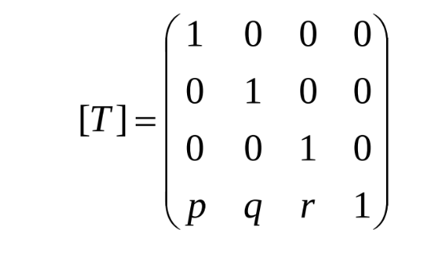
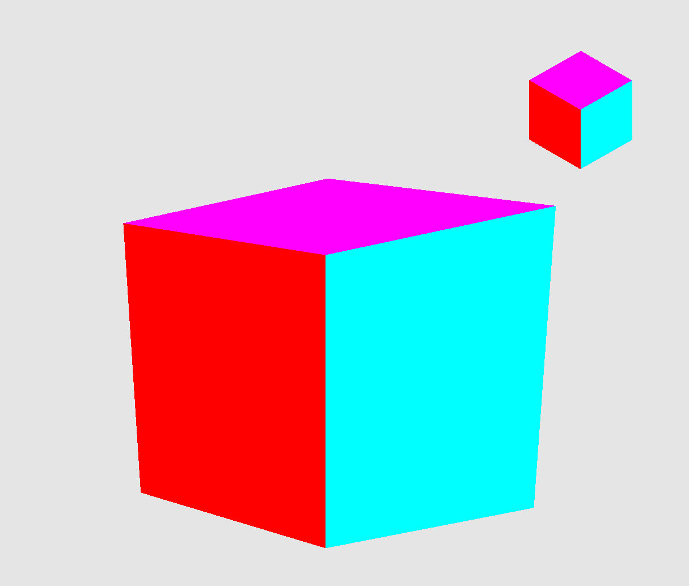

# Цели

Получение навыков совершения модельно-видовых преобразований на примере выполнения линейного
преобразования с кубом.

# Задачи

1. Определить куб в качестве модели объекта сцены.
2. Определить преобразования, позволяющие получить трехточечную перспективу. Для демонстрации проекции добавить в сцену куб (в стандартной
   ориентации, не изменяемой при модельно-видовых преобразованиях основного объекта).
3. Реализовать изменение ориентации и размеров объекта (навигацию камеры) с помощью
   модельно-видовых преобразований (без gluLookAt). Управление производится интерактивно с
   помощью клавиатуры и/или мыши.
4. Предусмотреть возможность переключения между каркасным и твердотельным
   отображением модели (glFrontFace/ glPolygonMode)

# Основная теория

## Однородные координаты

Это система координат, используемая в проективной геометрии, подобно тому, как декартовы координаты используются в евклидовой геометрии. Однородные координаты обладают тем свойством, что определяемый ими объект не меняется при умножении всех координат на одно и то же ненулевое число.

По большому счёту, однородные координаты нужны с единственной целью - чтобы при получении экранных координат точки не нужно было различать ортогональную и перспективную проекции.

## Линейное преобразование (линейный оператор)

Это отображение векторного пространства в само себя,
удовлетворяющее свойству линейности.

## Матричное представление линейного оператора

- Координаты представляются вектором-столбцом
- Геометрическое преобразование задается матрицей, умножаемой справа на вектор-столбец координат
- Матрица композиции преобразований является произведением матриц элементарных преобразований (матрицы перемножаются в обратном порядке): операция является ассоциативной, но в общем случае некоммутативной

## Виды преобразований

- общие линейные преобразования
  - w’ != 1 (проективные, необходимо «перспективное деление»)
  - прямые переходят в прямые
- аффинные преобразования
  - w’ = 1
  - сохраняется параллельность линий
  - пример: сдвиг
- преобразование подобия
  - сохраняются углы
  - пример: равномерное масштабирование
- изометрия (движение)
  - сохраняются расстояния
  - пример: поворот, перенос

## Центральные (перспективные) проекции

**Центральные проекции** параллельных прямых, не параллельных плоскости проекции будут сходиться в точке схода, количество которых (для прямых, параллельных осям
координат), зависит от числа координатных осей, которые пересекает плоскость проекции

### Матрица центральной проекции



Где


# Практическая реализация

```{.cpp .number-lines}
#include <GL/gl.h>
#include <GLFW/glfw3.h>
#include <GL/freeglut.h>

#include <iostream>
#include <cmath>

float theta = 0.61;
float phi = 0.78;

float theta1 = 0.61;
float phi1 = 0.78;
int VIEW_MODE = 4;

bool fill = false;

int x = 10;
int y = 10;
int z = -10;

using std::cos, std::sin;

void key(GLFWwindow *window, int key, int scancode, int action, int mods)
{
    if (action == GLFW_PRESS)
    {
        if (key == GLFW_KEY_ESCAPE)
        {
            glfwSetWindowShouldClose(window, GL_TRUE);
        }
        else if (key == GLFW_KEY_UP)
        {
            theta1 -= 0.1;
        }
        else if (key == GLFW_KEY_DOWN)
        {
            theta1 += 0.1;
        }
        else if (key == GLFW_KEY_LEFT)
        {
            phi1 += 0.1;
        }
        else if (key == GLFW_KEY_RIGHT)
        {
            phi1 -= 0.1;
        }
        else if (key == GLFW_KEY_Q)
        {
            fill = false;
        }
        else if (key == GLFW_KEY_W)
        {
            fill = true;
        }
    }
}

void DrawCube(GLfloat size)
{
    glBegin(GL_QUADS);
    // левая грань
    glColor3f(1.0, 0.0, 0.0);
    glVertex3f(-size / 2, -size / 2, -size / 2);
    glVertex3f(-size / 2, size / 2, -size / 2);
    glVertex3f(-size / 2, size / 2, size / 2);
    glVertex3f(-size / 2, -size / 2, size / 2);
    // правая грань
    glColor3f(0.0, 1.0, 0.0);
    glVertex3f(size / 2, -size / 2, -size / 2);
    glVertex3f(size / 2, -size / 2, size / 2);
    glVertex3f(size / 2, size / 2, size / 2);
    glVertex3f(size / 2, size / 2, -size / 2);
    // нижняя грань
    glColor3f(0.0, 0.0, 1.0);
    glVertex3f(-size / 2, -size / 2, -size / 2);
    glVertex3f(-size / 2, -size / 2, size / 2);
    glVertex3f(size / 2, -size / 2, size / 2);
    glVertex3f(size / 2, -size / 2, -size / 2);
    // верхняя грань
    glColor3f(1.0, 0.0, 1.0);
    glVertex3f(-size / 2, size / 2, -size / 2);
    glVertex3f(-size / 2, size / 2, size / 2);
    glVertex3f(size / 2, size / 2, size / 2);
    glVertex3f(size / 2, size / 2, -size / 2);
    // задняя грань
    glColor3f(1.0, 1.0, 0.0);
    glVertex3f(-size / 2, -size / 2, -size / 2);
    glVertex3f(size / 2, -size / 2, -size / 2);
    glVertex3f(size / 2, size / 2, -size / 2);
    glVertex3f(-size / 2, size / 2, -size / 2);
    // передняя грань
    glColor3f(0.0, 1.0, 1.0);
    glVertex3f(-size / 2, -size / 2, size / 2);
    glVertex3f(size / 2, -size / 2, size / 2);
    glVertex3f(size / 2, size / 2, size / 2);
    glVertex3f(-size / 2, size / 2, size / 2);

    glEnd();
}

void display(GLFWwindow *window)
{
    glEnable(GL_DEPTH_TEST);
    glDepthFunc(GL_LESS);
    glClear(GL_COLOR_BUFFER_BIT | GL_DEPTH_BUFFER_BIT);
    glMatrixMode(GL_MODELVIEW);
    glClearColor(0.9f, 0.9f, 0.9f, 1.0f);
    glPushMatrix();
    glLoadIdentity();

    glPolygonMode(GL_FRONT_AND_BACK, fill ? GL_FILL : GL_LINE);

    GLfloat m[4][4] = {
        {0.87, -0.09f, 0.98f, 0.49f},
        {0.0f, 0.98f, 0.35f, 0.17f},
        {0.5f, 0.15f, -1.7f, -0.85f},
        {0.0f, 0.0f, 1.0f, 2.0f}};

    // GLfloat m_perspective[4][4] = {
    //     {1.f, 0.f, 0.f, 0.f},
    //     {0.f, 1.f, 0.f, 0.f},
    //     {0.f, 0.f, 1.f, 0.f},
    //     {-1 / x, -1 / y, -1 / z, 1.f}};

    GLfloat m_perspective[4][4] = {
        {1.f, 0.f, 0.f, -(1.f / x)},
        {0.f, 1.f, 0.f, -(1.f / y)},
        {0.f, 0.f, 1.f, -(1.f / z)},
        {0.f, 0.f, 0.f, 1.f}};

    std::cout << -(1.f / x) << std::endl;

    GLfloat front_view[4][4] = {
        {1.f, 0.f, 0.f, 0.f},
        {0.f, 1.f, 0.f, 0.f},
        {0.f, 0.f, -1.f, 0.f},
        {0.f, 0.f, 0.f, 1.f}};

    GLfloat side_view[4][4] = {
        {0.f, 0.f, -1.f, 0.f},
        {0.f, 1.f, 0.f, 0.f},
        {-1.f, 0.f, 0.f, 0.f},
        {0.f, 0.f, 0.f, 1.f}};

    GLfloat top_view[4][4] = {
        {1.f, 0.f, 0.f, 0.f},
        {0.f, 0.f, -1.f, 0.f},
        {0.f, -1.f, 0.f, 0.f},
        {0.f, 0.f, 0.f, 1.f}};

    GLfloat m_rotate[4][4] = {
        {cos(phi1), sin(theta1) * sin(phi1), sin(phi1) * cos(theta1), 0.f},
        {0.0f, cos(theta1), -sin(theta1), 0.f},
        {sin(phi1), -cos(phi1) * sin(theta1), -cos(phi1) * cos(theta1), 0.f},
        {0.0f, 0.0f, 0.0f, 1.0f}};

    
   
    glMultMatrixf(&m_perspective[0][0]);
     glMultMatrixf(&m_rotate[0][0]);

    DrawCube(0.8);

    glPopMatrix();

    glPolygonMode(GL_FRONT_AND_BACK, GL_FILL);

    glPushMatrix();
    GLfloat m_move[4][4] = {
        {1.0, 0.f, 0.f, 0.f},
        {0.0f, 1.f, 0.f, 0.f},
        {0.f, 0.f, 1.f, 0.f},
        {0.7f, 0.7f, 0.7f, 1.f}};

    GLfloat m_isometry[4][4] = {
        {cos(phi), sin(theta) * sin(phi), sin(phi) * cos(theta), 0.f},
        {0.0f, cos(theta), -sin(theta), 0.f},
        {sin(phi), -cos(phi) * sin(theta), -cos(phi) * cos(theta), 0.f},
        {0.0f, 0.0f, 0.0f, 1.0f}};
    glMultMatrixf(&m_move[0][0]);
    glMultMatrixf(&m_isometry[0][0]);
    DrawCube(0.2);
    glPopMatrix();
}

int main(int argc, char **argv)
{
    if (!glfwInit())
        exit(1);

    GLFWwindow *window = glfwCreateWindow(1280, 1280, "Lab 1", NULL, NULL);

    if (window == NULL)
    {
        glfwTerminate();
        exit(1);
    }

    glfwMakeContextCurrent(window);
    glfwSwapInterval(1);
    glfwSetKeyCallback(window, key);

    while (!glfwWindowShouldClose(window))
    {
        display(window);
        glfwSwapBuffers(window);
        glfwPollEvents();
    }

    glfwDestroyWindow(window);
    glfwTerminate();
    return 0;

    return 0;
}

```



## Заключение

В ходе лабораторной работы было изучено, как выполнять модельно-видовые преобразования, в 
частности на разных объектах. Было изучено переключение режимов каркасного и полного 
отображения, а так же использование нескольних матриц для отрисовки разных объектов с 
разными преобразованиями.
